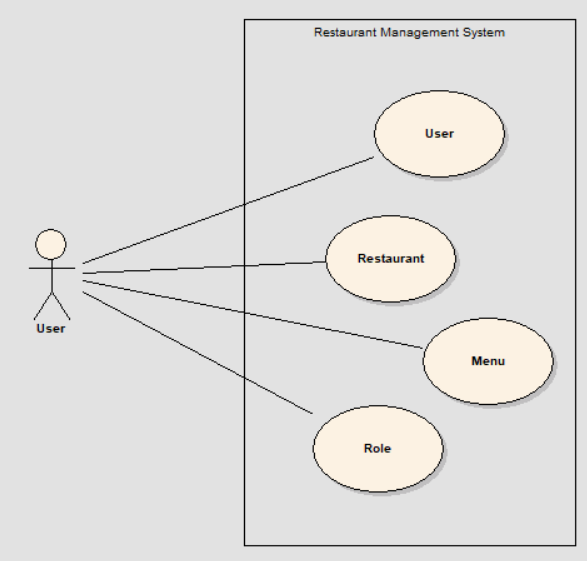
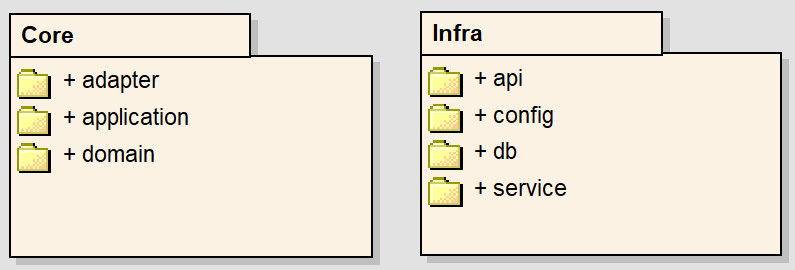
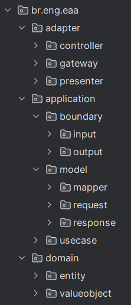
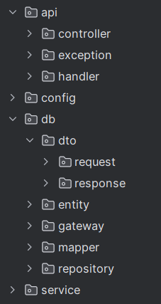
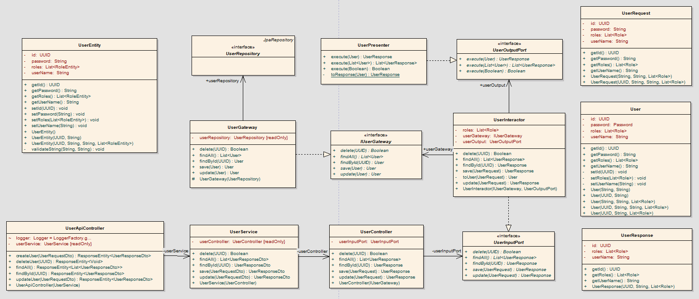
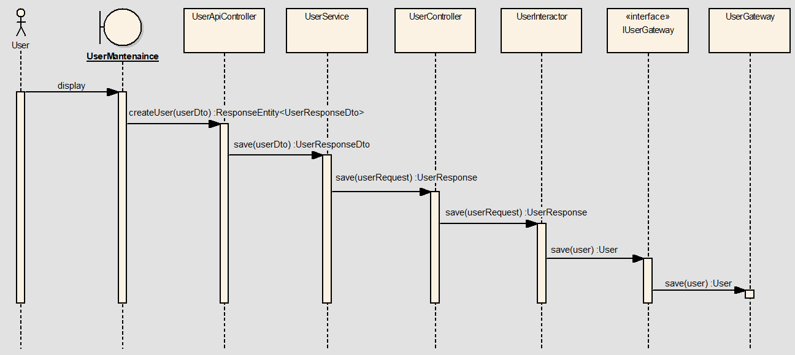
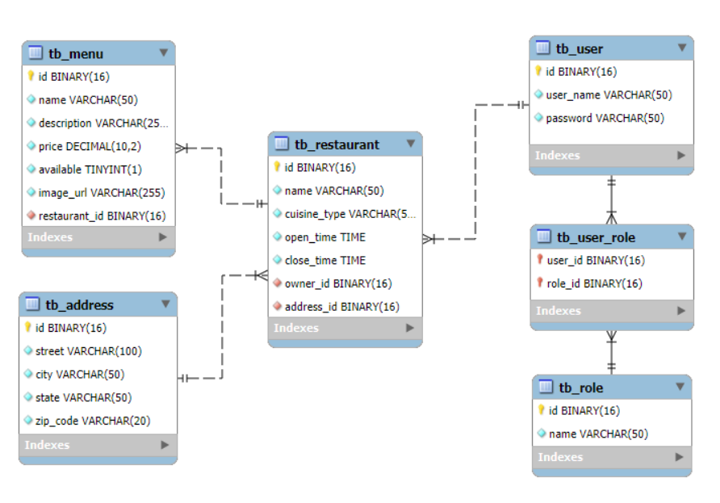
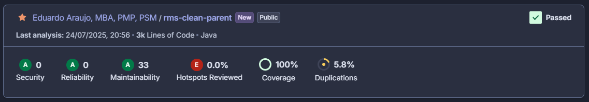
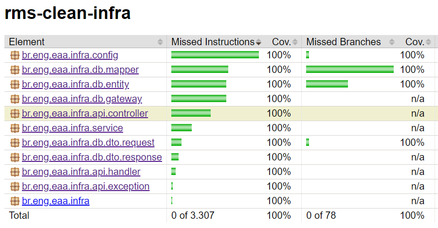
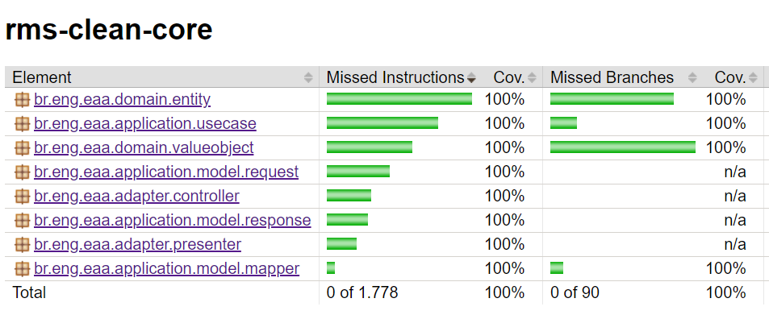

# Tech Challenge - Fase 2

## 1. Introdução 

### Descrição do Problema
Na nossa região, um grupo de restaurantes decidiu contratar estudantespara construir um sistema de gestão para seus estabelecimentos. Essa decisão
foi motivada pelo alto custo de sistemas individuais, o que levou os restaurantes a se unirem para desenvolver um sistema único e compartilhado. Esse sistema
permitirá que os clientes escolham restaurantes com base na comida oferecida, em vez de se basearem na qualidade do sistema de gestão.
O objetivo é criar um sistema robusto que permita a todos os restaurantes gerenciar eficientemente suas operações, enquanto os clientes poderão
consultar informações, deixar avaliações e fazer pedidos online. Devido à limitação de recursos financeiros, foi acordado que a entrega do sistema será
realizada em fases, garantindo que cada etapa seja desenvolvida de forma cuidadosa e eficaz.
A divisão em fases possibilitará uma implementação gradual e controlada, permitindo ajustes e melhorias contínuas conforme o sistema for sendo utilizado
e avaliado pelos restaurantes e clientes.

### Objetivo

Essa fase expande o sistema ao incluir a gestão dos tipos de usuários, cadastro de restaurantes e cardápios, reforçando práticas de desenvolvimento e
estruturação de código limpo. Além disso, são incluídos requisitos técnicos para garantir que o sistema mantenha alta qualidade e organização, com suporte 
para documentação, testes automatizados e infraestrutura Docker para uma execução integrada.

### Clean Architecture

MARTIN (2018, p. 204) define Clean Architecture como uma abordagem para organizar o código de forma que ele seja:
(i) independência de frameworks, (ii) testabilidade, 
(iii) independência de UI, (iv) independência de banco de dados, 
(v) independência de agentes externos e (vi) independência de bibliotecas.
O objetivo é criar um sistema que seja fácil de entender, manter e testar.
A ideia central é que o código deve ser organizado em camadas, 
onde cada camada tenha uma responsabilidade específica e dependa apenas das camadas internas.
O sistema é dividido em quatro camadas principais: Enterprise Business Rules (Entidades), Application Business Rules (Casos de Uso), Interface de Adapters e Frameworks e Drivers.
A figura abaixo ilustra a estrutura de camadas da Clean Architecture.


Na figura abaixo, MARTIN (2018, p. 209) mostra um cenário de sistema Java baseado na web usando um banco de dados. 
O servidor web coleta os dados de entrada do usuário e os entrega ao Controlador 
no canto superior esquerdo. O Controlador empacota esses dados em um objeto Java 
simples e o passa através do InputBoundary para o UseCaseInteractor. 
O UseCaseInteractor interpreta esses dados e os utiliza para controlar as Entidades. Ele também usa a DataAccessInterface para trazer os dados usados 
por essas Entidades para a memória a partir do Banco de Dados. 
Após a conclusão, o UseCaseInteractor coleta os dados das Entidades e 
constrói o OutputData como outro objeto Java simples. 
O OutputData é então passado através da interface OutputBoundary para o Presenter.


## 2. Arquitetura do Sistema

Para a solução do problema optou-se pela implementação de quatro casos de uso: User, Restaurant, Menu e Role. Cada caso de uso é responsável por realizar as operações de criação, consulta, atualização e exclusão (CRUD) sobre sua respectiva classe de domínio.

### Diagrama de Casos de Uso



### Módulos do Sistema

O sistema foi dividido em dois módulos, procurando manter a mesma nomenclatura de camadas proposta por MARTIN (2018). <br>

O primeiro módulo, chamado core, contém as três primeiras camadas:
- **Domain** (Enterprise Business Rules/Entities); 
- **Application** (Application Business Rules/Use Cases); e 
- **Adapter** (Interface Adapter).
<p> 
Esse módulo é totalmente independente de frameworks externos, mantendo o código mais coeso e voltado à lógica de negócio. <br>
O segundo módulo, chamado de Infra (Frameworks & Drivers), contém a implementação baseada no Spring Boot, sendo responsável pela integração com tecnologias externas ao domínio da aplicação. <br> 
A figura e tabela abaixo mostra a estrutura de pacotes do sistema. 




<table>
  <thead>
    <tr>
      <th>Módulo Core</th>
      <th>Módulo Infra</th>
    </tr>
  </thead>
  <tbody>
    <tr>
      <td valign="top"></td>
      <td valign="top"></td>
    </tr>
  </tbody>
</table>


### Diagrama de Classes

O diagrama de classes mostra um exemplo da estrutura das classes para a implementação do caso de uso **User**. Os demais casos de uso seguem o mesmo padrão. Nesse diagrama, pode-se observar como foi realizada a integração entre a camada de infra com a interface adapter.<br>
A classe **UserInteractor** faz a orquestração entre as interfaces de **UserInputPort** e **UserOutputPort** com as classes de domínio User e Role. As interfaces **IUserGateway** e **UserOutputPort** são injetadas na criação do objeto da classe **UserInteractor**, em conformidade com o princípio da inversão de dependência. <br>
A classe **UserGateway** implementa a interface **IUserGateway** e é resposável pela integração com a interface **UserRepository** do Spring Boot.



### Diagrama de Sequência

O diagrama de sequência mostra um exemplo do comportamento do sistema durante o processo de criação de um novo usuário.<br> 
A classe **UserAPIController** (@RestController), que realiza a chamada para a classe **UserService** (@Service). Em seguida, ***UserService** chama a classe **UserController**, que por sua vez chama a classe **UserInteractor**. É nessa etapa que a inclusão do usuário no banco de dados é realizada, por meio da interface **IUserGateway**.<br>
A implementação dessa interface é feita pela classe UserGateway, que é injetada na **UserController** por meio da classe de configuração UserConfig.



### Modelo Entidade-Relacionamento

O modelo abaixo mostra o relacionamento entre as tabelas do sistema



## 3. Descrição dos Endpoints

Esta API fornece um conjunto de endpoints RESTful para gerenciar usuários, restaurantes, itens de menu e papéis (roles) dentro do sistema.<br>
Todos os endpoints estão hospedados em http://localhost:8080/api/v1/ e assumem um corpo de requisição/resposta em JSON, quando aplicável.

### Endpoints de Usuário (User)
Estes endpoints gerenciam contas de usuário.

- Criar Usuário
  - Método: POST
  - URL: /users/create
  - Descrição: Cria uma nova conta de usuário.
  - Exemplo de Corpo da Requisição

```json
{
    "userName": "VALERIA",
    "password": "MinhaSenhaForte10#",
    "roles": [
        {
            "id": "4d5e6f7a-55ca-11f0-a29e-04bf1b4887e6",
            "name": "ADMIN"
        },
        {
            "id": "6f7a8b9c-55ca-11f0-a29e-04bf1b4887e6",
            "name": "OWNER"
        }
    ]
}
```

- Obter Usuário por ID
  - Método: GET
  - URL: /users/{id} (ex: /users/e0f279d7-5536-11f0-a29e-04bf1b4887e6)
  - Descrição: Recupera os detalhes de um usuário pelo seu ID único.

- Obter Todos os Usuários
  - Método: GET
  - URL: /users
  - Descrição: Recupera uma lista de todos os usuários registrados.

- Atualizar Usuário
  - Método: PUT
  - URL: /users/update
  - Descrição: Atualiza as informações de um usuário existente. O campo id no corpo da requisição é necessário para identificar o usuário.
  - Exemplo de Corpo da Requisição:
```json
{
    "id": "e0f279d7-5536-11f0-a29e-04bf1b4887e6",
    "userName": "EDUARDO ARAUJO",
    "password": "MinhaSenhaForte10#",
    "roles": [
        {
            "id": "5e6f7a8b-55ca-11f0-a29e-04bf1b4887e6",
            "name": "CUSTOMER"
        }
    ]
}
```

- Deletar Usuário
  - Método: DELETE
  - URL: /users/delete/{id} (ex: /users/delete/dea722bd-3383-4367-96a7-81d0232cc392)
  - Descrição: Deleta uma conta de usuário pelo seu ID único.


### Endpoints de Restaurante (Restaurant)
Estes endpoints gerenciam informações de restaurantes.

- Criar Restaurante
  - Método: POST
  - URL: /restaurants/create
  - Descrição: Registra um novo restaurante.
  - Exemplo de Corpo da Requisição:

```json
{
    "name": "Rebeca Food",
    "cuisineType": "JAPANESE",
    "openTime": "11:00:00",
    "closeTime": "22:00:00",
    "owner": {
        "id": "82c9e3fe-5537-11f0-a29e-04bf1b4887e6",
        "userName": "Eduardo"
    },
    "address": {
        "street": "Av. Paulista, 2207",
        "city": "Sao Paulo",
        "state": "SP",
        "zipCode": "06250-000"
    }
}
```

- Obter Restaurante por ID
  - Método: GET
  - URL: /restaurants/{id} (ex: /restaurants/6c642e31-55ca-11f0-a29e-04bf1b4887e6)
  - Descrição: Recupera os detalhes de um restaurante específico pelo seu ID único.

- Obter Todos os Restaurantes
  - Método: GET
  - URL: /restaurants
  - Descrição: Recupera uma lista de todos os restaurantes registrados.

- Atualizar Restaurante
  - Método: PUT
  - URL: /restaurants/update
  - Descrição: Atualiza as informações de um restaurante existente. O campo id no corpo da requisição é necessário para identificar o restaurante.
  - Exemplo de Corpo da Requisição:

```json
{
    "id": "6c642e31-55ca-11f0-a29e-04bf1b4887e6",
    "name": "EDU PIZZARIA",
    "cuisineType": "ITALIAN",
    "openTime": "11:00:00",
    "closeTime": "22:00:00",
    "owner": {
        "id": "e0f279d7-5536-11f0-a29e-04bf1b4887e6",
        "userName": "EDUARDO"
    },
    "address": {
        "id": "05e17290-c245-4547-be51-06d52bef6f50",
        "street": "Av. Paulista, 123",
        "city": "São Paulo",
        "state": "SP",
        "zipCode": "01334-567"
    }
}
```

- Deletar Restaurante
  - Método: DELETE
  - URL: /restaurants/delete/{id} (ex: /restaurants/delete/6c642e31-55ca-11f0-a29e-04bf1b4887e6)
  - Descrição: Deleta um restaurante pelo seu ID único.


### Endpoints de Menu
Estes endpoints gerenciam os itens de menu dos restaurantes.

- Criar Item de Menu
  - Método: POST
  - URL: /menus/create
  - Descrição: Cria um novo item de menu para um restaurante especificado. O campo restaurantId no corpo da requisição vincula o item de menu a um restaurante.
  - Exemplo de Corpo da Requisição:

```json
{
    "name": "Pizza Margherita",
    "description": "Clássica pizza com tomate, mussarela e manjericão",
    "price": 29.99,
    "available": true,
    "imageUrl": "http://example.com/pizza.jpg",
    "restaurantId": "6c642e31-55ca-11f0-a29e-04bf1b4887e6"
}
```

- Obter Todos os Itens de Menu
  - Método: GET
  - URL: /menus
  - Descrição: Recupera uma lista de todos os itens de menu disponíveis em todos os restaurantes.

- Obter Item de Menu por ID
  - Método: GET
  - URL: /menus/{id} (ex: /menus/9d5f1c6b-55ca-11f0-a29e-04bf1b4887e6)
  - Descrição: Recupera os detalhes de um item de menu específico pelo seu ID único.

- Atualizar Item de Menu
  - Método: PUT
  - URL: /menus/update
  - Descrição: Atualiza os detalhes de um item de menu existente. O campo id no corpo da requisição é necessário para identificar o item de menu.
  - Exemplo de Corpo da Requisição:

```json
{
    "id": "9d5f1c6b-55ca-11f0-a29e-04bf1b4887e6",
    "name": "MARGUERITA DOCE",
    "description": "Pizza com doce de leita, tomate e manjericão",
    "price": 69.90,
    "available": false,
    "imageUrl": "https://example.com/images/marguerita.jpg",
    "restaurantId": "6c642e31-55ca-11f0-a29e-04bf1b4887e6"
}
```

- Deletar Item de Menu
  - Método: DELETE
  - URL: /menus/delete/{id} (ex: /menus/delete/9d5f1c6b-55ca-11f0-a29e-04bf1b4887e6)
  - Descrição: Deleta um item de menu pelo seu ID único

### Endpoints de Papel (Role)
Estes endpoints gerenciam os papéis dos usuários.

- Criar Papel
  - Método: POST
  - URL: /roles/create
  - Descrição: Cria um novo papel de usuário.
  - Exemplo de Corpo da Requisição:

```json
{
    "name": "WAITER"
}
```

- Obter Papel por ID
  - Método: GET
  - URL: /roles/{id} (ex: /roles/4d5e6f7a-55ca-11f0-a29e-04bf1b4887e6)
  - Descrição: Recupera os detalhes de um papel específico pelo seu ID único.

- Obter Todos os Papéis
  - Método: GET
  - URL: /roles
  - Descrição: Recupera uma lista de todos os papéis disponíveis.

- Atualizar Papel
  - Método: PUT
  - URL: /roles/update
  - Descrição: Atualiza o nome de um papel existente. O campo id no corpo da requisição é necessário para identificar o papel.
  - Exemplo de Corpo da Requisição:

```json
{
    "id": "4d5e6f7a-55ca-11f0-a29e-04bf1b4887e6",
    "name": "ADMINISTRATOR"
}
```

- Deletar Papel
  - Método: DELETE
  - URL: /roles/delete/{id} (ex: /roles/delete/b570f45b-313e-43df-93cb-2f6475e95eda)
  - Descrição: Deleta um papel pelo seu ID único.

## 4. Configuração do Ambiente
Para a configuração do ambiente, foi utilizado o Docker Compose, que permite a criação de 
contêineres para o banco de dados MySQL e para a aplicação Spring Boot. 
O arquivo `docker-compose.yml` e o `dockerfile` estão localizados na raiz do projeto e contém as seguintes configurações:

```text
docker-compose up --build
```

### Docker Compose
```yaml
version: '3.8'

services:
  rms-app:
    build:
      context: .
      dockerfile: Dockerfile
    image: rms-app:1.0
    depends_on:
      mysql-db:
        condition: service_healthy
    environment:
      SPRING_DATASOURCE_URL: jdbc:mysql://mysql-db:3306/rms_clean_db?useSSL=false&allowPublicKeyRetrieval=true
      SPRING_DATASOURCE_USERNAME: root
      SPRING_DATASOURCE_PASSWORD: root
    ports:
      - "8080:8080"
    networks:
      - app-network

  mysql-db:
    image: mysql:8.0
    container_name: mysql_app
    environment:
      MYSQL_ROOT_PASSWORD: root
      MYSQL_DATABASE: rms_clean_db
    ports:
      - "3306:3306"
    volumes:
      - mysql-data:/var/lib/mysql
    networks:
      - app-network

volumes:
  mysql-data:

networks:
  app-network:
    driver: bridge
```

### Dockerfile

```dockerfile
# Etapa 1: Construção
FROM maven:3.9.6-amazoncorretto-21 AS build
WORKDIR /app

# Copiar todos os arquivos pom.xml
COPY pom.xml .
COPY rms-clean-core/pom.xml ./rms-clean-core/
COPY rms-clean-infra/pom.xml ./rms-clean-infra/

# Copiar o restante do código-fonte necessário para resolver as dependências
RUN mvn dependency:go-offline

# Copiar o restante do código-fonte
COPY rms-clean-core/src ./rms-clean-core/src
COPY rms-clean-infra/src ./rms-clean-infra/src

# Construir o aplicativo
RUN mvn clean package -DskipTests

# Etapa 2: Execução
FROM amazoncorretto:21
WORKDIR /app

# Copiar o JAR construído da etapa anterior
COPY --from=build /app/rms-clean-infra/target/*.jar /app/rms-clean-infra.jar
ENTRYPOINT ["java", "-jar", "rms-clean-infra.jar"]
```

## 5. Documentação da API

Para a documentação da API, foi utilizado o Swagger, que permite a 
visualização e teste dos endpoints de forma interativa. 
A documentação pode ser acessada através da URL: [swagger-ui](http://localhost:8080/swagger-ui/index.html).

## 6. Qualidade do Código

Para avaliar a qualidade do código, foi usado o SonarQube. A figura abaixo mostra o resultado da análise.



### ci.yml
```yaml
name: CI Pipeline

on:
  push:
    branches: ["main", "develop", "feature/**", "bugfix/**"]
  workflow_dispatch:

jobs:
  build:
    runs-on: ubuntu-latest

    steps:
      - name: Checkout repository
        uses: actions/checkout@v4
        with:
          fetch-depth: 0

      - name: Set up JDK 21
        uses: actions/setup-java@v3
        with:
          java-version: "21"
          distribution: "temurin"
          cache: maven

      - name: Cache Maven packages
        uses: actions/cache@v3
        with:
          path: ~/.m2
          key: ${{ runner.os }}-maven-${{ hashFiles('**/pom.xml') }}
          restore-keys: ${{ runner.os }}-maven

      - name: Build with Maven and Run Tests
        env:
          SPRING_PROFILES_ACTIVE: test-in-memory
        run: mvn clean install

      - name: SonarCloud Scan
        env:
          SONAR_TOKEN: ${{ secrets.SONAR_TOKEN }}
          SPRING_PROFILES_ACTIVE: test-in-memory
        run: |
          # Execute SonarCloud scan from the root directory.
          # SonarCloud automatically detects Maven multi-module projects.
          # Removido os prefixos dos nomes dos módulos dos caminhos em sonar.sources, sonar.tests e sonar.java.binaries.
          # O Sonar Scanner for Maven deve ser capaz de inferir os caminhos corretos para cada módulo.
          mvn sonar:sonar \
            -Dsonar.projectKey=EduardoAguiarDeAraujo_eaa-postech-rms-app \
            -Dsonar.organization=eduardoaguiardearaujo \
            -Dsonar.host.url=https://sonarcloud.io \
            -Dsonar.token=${{ secrets.SONAR_TOKEN }} \
            -Dsonar.coverage.jacoco.xmlReportPaths=rms-clean-core/target/site/jacoco/jacoco.xml,rms-clean-infra/target/site/jacoco/jacoco.xml \
            -Dsonar.sources=src/main/java \
            -Dsonar.tests=src/test/java \
            -Dsonar.java.binaries=target/classes

      - name: Upload Test Results - Infra Module
        if: always()
        uses: actions/upload-artifact@v4
        with:
          name: test-results-infra
          path: rms-clean-infra/target/surefire-reports

      - name: Upload Test Results - Core Module
        if: always()
        uses: actions/upload-artifact@v4
        with:
          name: test-results-core
          path: rms-clean-core/target/surefire-reports
```

## 7. Cobertura de Testes

Para avaliar a cobertura de testes do sistema foi utilizada a biblioteca do Jacoco. As imagens abaixo mostram a cobertura de testes do sistema, que está acima de 90% para os casos de uso implementados.

### Módulo Core


### Módulo Infra


## 8. Collections do Postman

A coleção de testes no postman está disponível na pasta ./postman
[TechChallenge2.postman_collection.json](.postman/TechChallenge2.postman_collection.json)

## 9. Repositório do Código
O código-fonte do sistema está disponível no repositório do GitHub: [rms-clean](https://github.com/EduardoAguiarDeAraujo/eaa-postech-rms-app)

## 10. Referências 
MARTIN, Robert C. Clean Architecture: A Craftsman's Guide to Software Structure and Design. Boston: Pearson Education, 2018.
