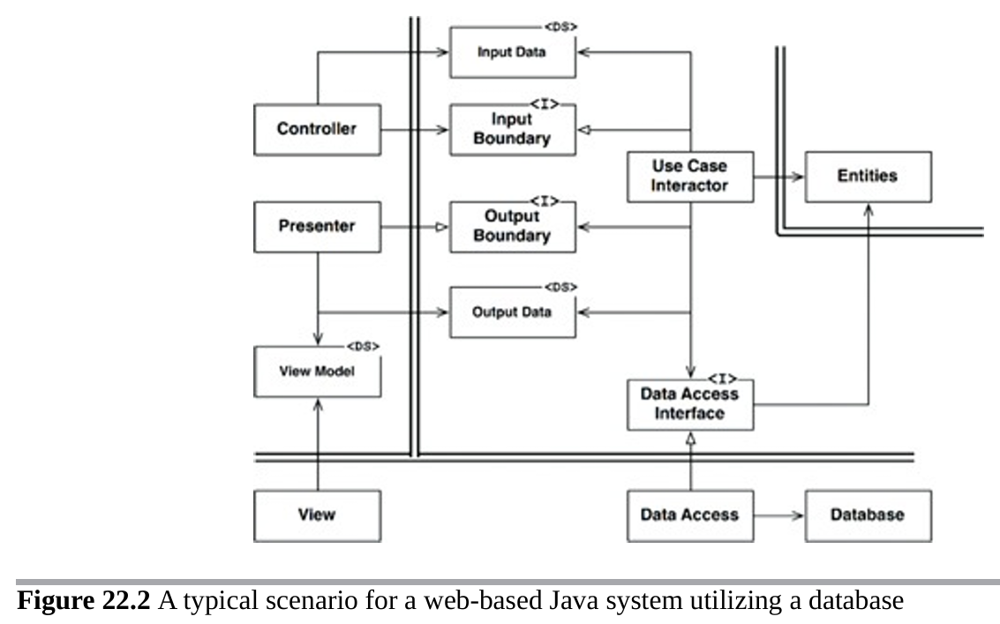

# Tech Challenge - Fase 2


## 1. Introdução 

### Descrição do Problema
Na nossa região, um grupo de restaurantes decidiu contratar estudantespara construir um sistema de gestão para seus estabelecimentos. Essa decisão
foi motivada pelo alto custo de sistemas individuais, o que levou os restaurantes a se unirem para desenvolver um sistema único e compartilhado. Esse sistema
permitirá que os clientes escolham restaurantes com base na comida oferecida, em vez de se basearem na qualidade do sistema de gestão.
O objetivo é criar um sistema robusto que permita a todos os restaurantes gerenciar eficientemente suas operações, enquanto os clientes poderão
consultar informações, deixar avaliações e fazer pedidos online. Devido à limitação de recursos financeiros, foi acordado que a entrega do sistema será
realizada em fases, garantindo que cada etapa seja desenvolvida de forma cuidadosa e eficaz.
A divisão em fases possibilitará uma implementação gradual e controlada, permitindo ajustes e melhorias contínuas conforme o sistema for sendo utilizado
e avaliado pelos restaurantes e clientes.

### Objetivo

Essa fase expande o sistema ao incluir a gestão dos tipos de usuários, cadastro de restaurantes e cardápios, reforçando práticas de desenvolvimento e
estruturação de código limpo. Além disso, são incluídos requisitos técnicos para garantir que o sistema mantenha alta qualidade e organização, com suporte 
para documentação, testes automatizados e infraestrutura Docker para uma execução integrada.

### Fundamentação Teórica - Clean Architecture

MARTIN (2018, p. 204) define Clean Architecture como uma abordagem para organizar o código de forma que ele seja:
(i) independência de frameworks, (ii) testabilidade, 
(iii) independência de UI, (iv) independência de banco de dados, 
(v) independência de agentes externos e (vi) independência de bibliotecas.
O objetivo é criar um sistema que seja fácil de entender, manter e testar.
A ideia central é que o código deve ser organizado em camadas, 
onde cada camada tenha uma responsabilidade específica e dependa apenas das camadas internas.
O sistema é dividido em quatro camadas principais: Enterprise Business Rules (Entidades), Application Business Rules (Casos de Uso), Interface de Adapters e Frameworks e Drivers.
A figura abaixo ilustra a estrutura de camadas da Clean Architecture.


A figura abaixo, MARTIN (2018, p. 209), mostra um cenário de sistema Java baseado na web usando um banco de dados. 
O servidor web coleta os dados de entrada do usuário e os entrega ao Controlador 
no canto superior esquerdo. O Controlador empacota esses dados em um objeto Java 
simples e o passa através do InputBoundary para o UseCaseInteractor. 
O UseCaseInteractor interpreta esses dados e os utiliza para controlar as Entidades. Ele também usa a DataAccessInterface para trazer os dados usados 
por essas Entidades para a memória a partir do Banco de Dados. 
Após a conclusão, o UseCaseInteractor coleta os dados das Entidades e 
constrói o OutputData como outro objeto Java simples. 
O OutputData é então passado através da interface OutputBoundary para o Presenter.



## 2. Arquitetura do Sistema

Para a solução do problema optou-se pela implementação de quatro casos de uso: User, Restaurant, Menu e Role. Cada caso de uso é responsável por realizar as operações de criação, consulta, atualização e exclusão (CRUD) sobre sua respectiva classe de domínio.

### Diagrama de Casos de Uso


O sistema foi dividido em dois módulos, procurando manter a mesma nomenclatura de camadas proposta por MARTIN (2018). <br>
O primeiro módulo, chamado core, contém as três primeiras camadas:
- **Domain** (Enterprise Business Rules/Entities); 
- **Application** (Application Business Rules/Use Cases); e 
- **Adapter** (Interface Adapter).
<p> 
Esse módulo é totalmente independente de frameworks externos, mantendo o código mais coeso e voltado à lógica de negócio. <br>
O segundo módulo, chamado de Infra (Frameworks & Drivers), contém a implementação baseada no Spring Boot, sendo responsável pela integração com tecnologias externas ao domínio da aplicação. <br> 
A tabela abaixo mostra a estrutura de pacotes do sistema. 

<table>
  <thead>
    <tr>
      <th>Módulo Core</th>
      <th>Módulo Infra</th>
    </tr>
  </thead>
  <tbody>
    <tr>
      <td valign="top"></td>
      <td valign="top"></td>
    </tr>
  </tbody>
</table>


### Diagrama de Classes

O diagrama de classes mostra um exemplo da estrutura das classes para a implementação do caso de uso **User**. Os demais casos de uso seguem o mesmo padrão. Nesse diagrama, pode-se observar como foi realizada a integração entre a camada de infra com a interface adapter.<br>
A classe **UserInteractor** faz a orquestração entre as interfaces de **UserInputPort** e **UserOutputPort** com as classes de domínio User e Role. As interfaces **IUserGateway** e **UserOutputPort** são injetadas na criação do objeto da classe **UserInteractor**, em conformidade com o princípio da inversão de dependência. <br>
A classe **UserGateway** implementa a interface **IUserGateway** e é resposável pela integração com a interface **UserRepository** do Spring Boot.


### Diagrama de Sequência

O diagrama de sequência mostra um exemplo do comportamento do sistema durante o processo de criação de um novo usuário.<br> 
A classe **UserAPIController** (@RestController), que realiza a chamada para a classe **UserService** (@Service). Em seguida, ***UserService** chama a classe **UserController**, que por sua vez chama a classe **UserInteractor**. É nessa etapa que a inclusão do usuário no banco de dados é realizada, por meio da interface **IUserGateway**.<br>
A implementação dessa interface é feita pela classe UserGateway, que é injetada na **UserController** por meio da classe de configuração UserConfig.


### Modelo Entidade-Relacionamento

O modelo abaixo mostra o relacionamento entre as tabelas do sistema


## 3. Descrição dos Endpoints

## 4. Configuração do Ambiente
Para a configuração do ambiente, foi utilizado o Docker Compose, que permite a criação de 
contêineres para o banco de dados MySQL e para a aplicação Spring Boot. 
O arquivo `docker-compose.yml` está localizado na raiz do projeto e contém as seguintes configurações:

```text
docker-compose up --build
```

### Docker Compose
```yaml
version: '3.8'

services:
  rms-app:
    build:
      context: .
      dockerfile: Dockerfile
    image: rms-app:1.0
    depends_on:
      mysql-db:
        condition: service_healthy
    environment:
      SPRING_DATASOURCE_URL: jdbc:mysql://mysql-db:3306/rms_clean_db?useSSL=false&allowPublicKeyRetrieval=true
      SPRING_DATASOURCE_USERNAME: root
      SPRING_DATASOURCE_PASSWORD: root
    ports:
      - "8080:8080"
    networks:
      - app-network

  mysql-db:
    image: mysql:8.0
    container_name: mysql_app
    environment:
      MYSQL_ROOT_PASSWORD: root
      MYSQL_DATABASE: rms_clean_db
    ports:
      - "3306:3306"
    volumes:
      - mysql-data:/var/lib/mysql
    networks:
      - app-network

volumes:
  mysql-data:

networks:
  app-network:
    driver: bridge
```

### Dockerfile

```dockerfile
# Etapa 1: Construção
FROM maven:3.9.6-amazoncorretto-21 AS build
WORKDIR /app

# Copiar todos os arquivos pom.xml
COPY pom.xml .
COPY rms-clean-core/pom.xml ./rms-clean-core/
COPY rms-clean-infra/pom.xml ./rms-clean-infra/

# Copiar o restante do código-fonte necessário para resolver as dependências
RUN mvn dependency:go-offline

# Copiar o restante do código-fonte
COPY rms-clean-core/src ./rms-clean-core/src
COPY rms-clean-infra/src ./rms-clean-infra/src

# Construir o aplicativo
RUN mvn clean package -DskipTests

# Etapa 2: Execução
FROM amazoncorretto:21
WORKDIR /app

# Copiar o JAR construído da etapa anterior
COPY --from=build /app/rms-clean-infra/target/*.jar /app/rms-clean-infra.jar
ENTRYPOINT ["java", "-jar", "rms-clean-infra.jar"]
```

## 5. Documentação da API
Para a documentação da API, foi utilizado o Swagger, que permite a 
visualização e teste dos endpoints de forma interativa. 
A documentação pode ser acessada através da URL: [swagger-ui](http://localhost:8080/swagger-ui/index.html).

## 6. Cobertura de Testes

Para avaliar a cobertura de testes do sistema foi utilizada a biblioteca do Jacoco. As imagens abaixo mostram a cobertura de testes do sistema, que está acima de 90% para os casos de uso implementados.

### Módulo Core


### Módulo Infra


## 7. Repositório do Código
O código-fonte do sistema está disponível no repositório do GitHub: [rms-clean](

## Referências 
MARTIN, Robert C. Clean Architecture: A Craftsman's Guide to Software Structure and Design. Boston: Pearson Education, 2018.


